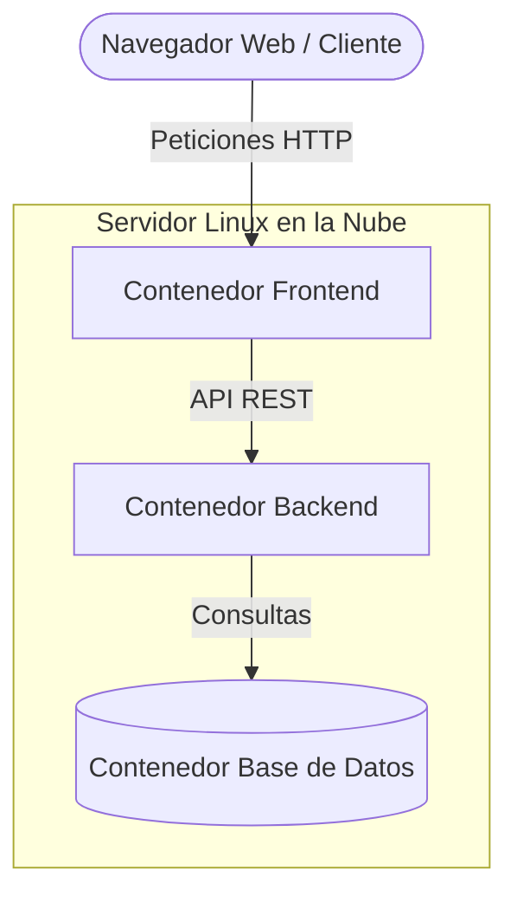

# Proyecto-Final-SO2-Arqui1
PROYECTO Robótica y Servidor Web Linux

## 👥 Integrantes del Equipo

| Nombre del Integrante | Carné|
| :--- | :--- |
| Carlos Enrique Aguilar Sirín |1990-18-13889|
| Elicia Idaida Más Canel    |1990-23-20746|
| Yessica Amanda Chalí Serech |1990-21-11634|

Este repositorio contiene el código fuente de los tres componentes principales del sistema (Frontend, Backend y Base de Datos) desplegados en un entorno contenerizado.

## 1. Dirección IP pública del servidor
Los servicios se encuentran en ejecución y accesibles a través de la siguiente dirección IP pública:

**⚠️ Nota importante sobre la Dirección IP:**
Actualmente, el sistema no cuenta con un dominio propio y está alojado en una instancia en la nube con una **IP pública dinámica**. Esto significa que cada vez que la instancia se detiene y se reinicia, la dirección IP cambia. Para acceder al sistema, asegúrese de utilizar la IP proporcionada en la **Sección 1** de este documento. En caso de que el enlace no responda, contacte al autor para obtener la dirección IP vigente.

*(Nota: Backend en el 5000).*

## 2. Diseño de la Arquitectura del Sistema

A continuación se presenta el diagrama de arquitectura implementado en la nube. El sistema sigue un modelo de tres capas contenerizado:

Descripción del Flujo de Trabajo y Tolerancia a Fallos:
Flujo Normal: El cliente interactúa con la interfaz web (Frontend), la cual realiza peticiones HTTP/REST hacia la API del Backend. El backend procesa las solicitudes y gestiona el almacenamiento o lectura de eventos en la Base de Datos.

Caída del Backend: Si el contenedor del backend se detiene, la interfaz web permanece accesible, pero las acciones que requieran procesamiento lógico fallarán y no se registrarán nuevos eventos.

Caída de la Base de Datos: Si la base de datos se detiene, el backend sigue recibiendo las peticiones del frontend o de fuentes externas, pero los logs reportarán errores de conexión y los eventos no se almacenarán de forma permanente.

Caída del Frontend: Si la interfaz web se cae, el acceso visual queda interrumpido. Sin embargo, el backend y la base de datos continúan operativos, permitiendo la recepción y almacenamiento automático de eventos a través de peticiones directas a la API (vía cURL o Postman).

## 3. Tecnologías Utilizadas

El sistema ha sido desarrollado utilizando un ecosistema de herramientas robustas y modernas, unificando toda la lógica de programación bajo el lenguaje **Python** y estructurando el proyecto en una arquitectura contenerizada de tres capas.

### Infraestructura y Despliegue
* **Proveedor de Nube:** AWS (Amazon Web Services) mediante una instancia EC2.
* **Sistema Operativo:** Ubuntu Server (Linux) como entorno base del servidor.
* **Orquestación y Contenedores:** Docker y Docker Compose, permitiendo el aislamiento y ejecución independiente de cada componente (Frontend, Backend y Base de Datos).

### Frontend (Capa de Presentación)
* **Lenguajes:** HTML5 y CSS3 para la estructura, maquetación e interfaz gráfica expuesta al usuario.
* **Servidor Web:** Nginx, encargado de servir los archivos estáticos del frontend de manera eficiente y actuar como puerta de enlace.

### Backend (Capa de Lógica de Negocio)
* **Lenguaje de Programación:** Python 3.x.
* **Framework:** Flask, utilizado para la construcción de la API REST, procesamiento de la lógica del sistema y gestión del flujo de los eventos.

### Base de Datos (Capa de Persistencia)
* **Motor de Base de Datos:** MongoDB (NoSQL), seleccionado por su flexibilidad para el almacenamiento de registros y eventos mediante documentos JSON/BSON.

---

## 4. Instrucciones de Uso y Pruebas del Sistema
Paso 1: Encendido e Inicialización del Hardware Local

- Energizar el robot: Conectar la fuente de alimentación (baterías o cable de alimentación) al microcontrolador Arduino y a los             controladores de los motores.

- Verificar el sensor: Asegurarse de que el sensor de humedad esté correctamente insertado en el suelo o sustrato a analizar.

- Confirmar conectividad local: Verificar que el módulo Bluetooth del robot esté encendido (comúnmente indicado por un parpadeo rápido en su luz LED, esperando vinculación).

Paso 2: Vinculación y Puente de Red (Desde el Dispositivo Móvil)
Para que el hardware se comunique con la nube, el dispositivo Android con Termux debe actuar como pasarela (Gateway):

Abrir la aplicación Termux en el teléfono móvil.

Asegurar el enlace Bluetooth/Serial con el Arduino mediante la terminal (comprobando que esté asignado al bus físico correspondiente, usualmente en /dev/ttyUSB0 o un puerto serial equivalente).

Conectarse de forma remota a la instancia de AWS para asegurar que el canal de datos esté listo, utilizando la llave criptográfica:
ssh -i "SOII&ACI.pem" ubuntu@(IP_GENERADA)

Paso 3: Lanzamiento de los Servicios en la Nube (AWS EC2)
Una vez dentro de la terminal de Ubuntu en AWS mediante la sesión SSH del paso anterior:

Dirigirse al directorio donde se encuentra el proyecto clonado.

Comprobar que tanto el backend de Flask como la base de datos MongoDB estén en ejecución activa con:
sudo docker ps

(MongoDB Compass)
Cada vez que se presiona un botón en la interfaz web, el sistema guarda un registro histórico (log) inalterable. Para auditar y visualizar estos datos de forma externa:

Iniciar la herramienta de escritorio MongoDB Compass en su computadora.

En la barra de conexión (URI), ingresar la dirección del servidor remoto:

mongodb://54.167.220.189:27017/
Hacer clic en "Connect".

### Acceso al Sistema
1. Abra un navegador web.
2. Ingrese a la dirección: `http://<TU_IP_ACTUAL_AQUI>` (Ejemplo: `http://54.219.xxx.xxx`).
3. Se mostrará la interfaz principal (Frontend servido por Nginx).

### Flujo Básico de Uso
1. **Generación de Eventos:** En la interfaz web, utilice los controles disponibles para registrar un nuevo evento.
2. **Confirmación:** El sistema enviará la petición al Backend (Flask), el cual procesará la información y devolverá un mensaje de éxito en pantalla.
3. **Persistencia:** Si accede a la base de datos (MongoDB), podrá verificar que el documento JSON con la información del evento se ha guardado correctamente.

### Pruebas de Tolerancia a Fallos (Demostración)
El sistema está diseñado en contenedores aislados. Para comprobar el comportamiento ante fallos, puede ejecutar los siguientes comandos en la terminal del servidor:

* **Prueba de caída del Backend:**
  Ejecute `docker stop backend_container`. Si intenta enviar un evento desde la página web, la interfaz seguirá funcionando, pero mostrará un error de conexión, demostrando que no se registran eventos falsos.
  *(Para restaurar: `docker start backend_container`)*

* **Prueba de caída de Base de Datos:**
  Ejecute `docker stop mongodb_container`. Al enviar un evento desde la web o mediante API, el Backend lo recibirá, pero los logs (`docker logs backend_container`) mostrarán un error al intentar persistir los datos, demostrando que no se almacenan.
  *(Para restaurar: `docker start mongodb_container`)*

* **Prueba de caída del Frontend:**
  Ejecute `docker stop frontend_container`. La página web dejará de cargar en el navegador. Sin embargo, si se envía una petición `POST` directamente a la API del Backend (por ejemplo, usando Postman o cURL a `http://<IP_ACTUAL>:<PUERTO_BACKEND>/endpoint`), el evento se procesará y guardará correctamente en la base de datos.
